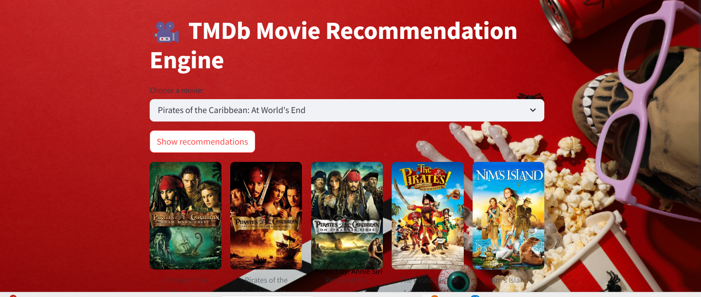

# 🎬 Movie Recs with Streamlit

An interactive movie recommendation system built using Python and Streamlit. It uses TF-IDF vectorization and basic NLP techniques to recommend movies based on similarity in descriptions and metadata.



## 🚀 Overview

This project aims to suggest movies that align with a user's preferences by analyzing content similarities. By computing cosine similarity scores through TF-IDF, the system generates intelligent, content-based movie suggestions through a Streamlit interface.

## 🔍 Features

- **Content-Based Filtering**: Utilizes TF-IDF to analyze movie overviews and generate similarity scores.
- **Simple UI**: Built with Streamlit for an intuitive and lightweight user experience.
- **Poster Display**: Uses The Movie Database (TMDb) API to fetch movie posters dynamically.

## 🛠️ Installation

To run this project locally, follow these steps:

### 1. Clone this repository

```bash
git clone https://github.com/annie-2314/movie-recs-streamlit.git
cd movie-recs-streamlit
```

### 2. Install the dependencies

```bash
pip install -r requirements.txt
```

## ▶️ How to Use

Start the application using:

```bash
streamlit run app.py
```

Once running, open the app in your browser. Select a movie from the dropdown to get a list of recommended movies along with their posters.

## 📚 Technologies Used

- Python
- Streamlit
- TF-IDF Vectorization
- NLP (Natural Language Processing)
- Cosine Similarity
- TMDb API
- Pandas

---

👤 **Project by:** Annie Siri  
📌 Educational demo for movie recommendation based on content similarity.
